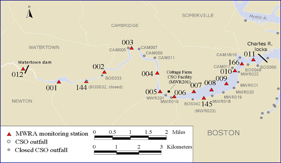

<br/>

# **R Tutorial: Part 2**

```{r, echo=FALSE}

# R stats meme
url <- "https://sakaluk.files.wordpress.com/2016/02/4282183.jpg?w=312&h=390"

```
<center></center>

## **Goals for this tutorial**

* Create basic figures
  * bar plot
  * scatter plot
  * line graph
* Perform a simple linear regression on data
* Load .csv file of data


## **Making simple figures**

Now that we have calculated some summary statistics, we will want to work on visualizing these data in figures. There are many different and appropriate ways to visualize these types of data, but we will explore just a few in the course: **bar plot, line graph, and scatter plot**.

[Here is a really nice website for making charts and graphs in R.](https://www.r-graph-gallery.com/index.html) It is broken down by types of data so may also be helpful when exploring your own data!

To practice making figures, we are going to again work with the ```iris``` data set so go ahead and load that below:

```{r}

## Load the iris dataset here


```

Do you remember the **structure** of this data? Let's review the structure below:

```{r}

## View the STRUCTURE of the iris data frame using what you learned in your previous R tutorial


```

Great! So you know the ```Species``` is a ```Factor``` and that the other parameters are ```numeric``` and that you have 150 observations, or rows of data. Time to make out first figure!

<br/>

### **Bar plots**

To begin, we will create bar plots of the ```iris``` data to visualize some of the parameters from the data set. Bar plots are useful for depicting values of categorical variables, mean and standard errors, and percentages. There are different ways to create figures in R, however, the ```tidyverse``` provides a simple, yet highly editable function for creating figures that we will use here: ```ggplot2()```.

Go ahead and install and load the ```ggplot2()``` package below:
```{r}

## Install ggplot2:

## Load ggplot2 package
library(ggplot2)

```

As always, as you get more comfortable with R, you should explore the package [documentation](https://ggplot2.tidyverse.org/reference/ggplot.html) to better understand what you can do with the package, but for now we will just start with a basic bar plot.

While the package is called ```ggplot2()```, the actual function to create the plot is just ```ggplot()```. If you just run the function in your script, it will produce a blank space (and will pop up under your **Plots** area in your R Studio window if have it open). 

```{r}

ggplot()

```


The function ```ggplot()``` allows a lot of creativity for creating figures, but most figures require the same basic calls within the function to run: a data frame, axis variables (x, y, or both), and what type of graph to produce. Again, if we just provide the data frame (```data = iris```) and the aesthetics with the y axes (```aes(y = Species)```), we now see the blank space populated with a grey background, a x axis label of **Species** and the three species names (also on the y axis), but no data is plotted. 

```{r}

ggplot(data = iris, aes(x = Species))

```

The reason we do not have any data plotted in the above space is because we need to specify HOW to display the data. For example, to make a simple bar plot to show the the number of counts of each ```Species``` in the data frame, we need to tell ```ggplot()``` we want to produce a bar plot (```geom_bar()```) and we do that by adding another function to the base ```ggplot()``` function like below:

```{r}

ggplot(data = iris, aes(x = Species)) +
  geom_bar()

```

We now have a bar graph that displays the ```Species``` of iris on the x axis and bars that show the number of each ```Species``` within the data frame along the y axis. This is a great way to visualize the sample size, or ```N```, of each ```Species```. 

<br/>

Bar plots are also useful to display summary statistics of data. Based on what you learned in the previous tutorial, go ahead and calculate the **mean, sample size, standard deviation, and standard error** of the ```Sepal.Width``` per ```Species``` using both ```summarySE()``` and ```tidyverse``` below (name the summary data frame ```sepal_length_summary```):

```{r}

## Load the package that contains the summarySE() function


## Load the tidyverse
library(tidyverse)

## Calculate summary stats using summarySE()


## Calculate summary stats using the tidyverse

sepal_length_summary <- iris %>% 
  group_by(Species) %>%
  summarise(mean_Sepal.Length = mean(Sepal.Length),
            sd_Sepal.Length = sd(Sepal.Length),
            N = n(),
            se_Sepal.Length = sd_Sepal.Length / sqrt(N))

```

Double check that your summary statistics make sense, and then we can create a new bar plot to show the mean ```Sepal.Width``` per ```Species```. This is slightly different than the count plot code above.

1. First, you need to update the ```data``` to specify the ```sepal_length_summary``` data frame.
2. Specify the y axis parameter to display the ```mean_Sepal.Length```.
3. Finally, within the ```geom_bar()``` function, you want to specify ```stat = "identity"```. This is the distinction that is required to tell ```ggplot()``` that you will be supplying the y values to plot instead of the count.

```{r}

ggplot(data = sepal_length_summary, aes(x = Species, y = mean_Sepal.Length)) +
  geom_bar(stat = "identity")

```

This is good, but lets add a more neat y axis label. We can update the x and y labels by adding another line of code that calls the function ```labs()```. Here, we are only going to update the y axis, but you can also use this to add a new x axis title if you need.

```{r}

ggplot(data = sepal_length_summary, aes(x = Species, y = mean_Sepal.Length)) +
  geom_bar(stat = "identity") +
  labs(y = "Mean sepal length")

```

Next, we want to add error bars to each bar to depict the the standard deviation from the mean. This time, we need to add a new function to our figure code called ```geom_errorbar()```. Within that function, you again want to pass information to the function using the ```aes()``` call. 

```{r}

ggplot(data = sepal_length_summary, aes(x = Species, y = mean_Sepal.Length)) +
  geom_bar(stat = "identity") +
  labs(y = "Mean sepal length") +
  geom_errorbar(aes(ymin = mean_Sepal.Length - sd_Sepal.Length, ymax = mean_Sepal.Length + sd_Sepal.Length))

```

Looks great! We can now see what kind of deviation around the mean there is for each iris species. The last thing we will do here is change the colours of the bars so that the each species is represented by a different colour. This part of the code is added within the initial ```ggplot()``` function in the ```aes()``` call. With a bar plot, adding ```fill = Species``` will give each species name a different colour (compare this with using ```colour = Species``` which only changes the bar outline colour).

```{r}

ggplot(data = sepal_length_summary, aes(x = Species, y = mean_Sepal.Length, fill = Species)) +
  geom_bar(stat = "identity") +
  labs(y = "Mean sepal length") +
  geom_errorbar(aes(ymin = mean_Sepal.Length - sd_Sepal.Length, ymax = mean_Sepal.Length + sd_Sepal.Length))

```

We now have an informative bar plot that shows the mean sepal length (```mean_Sepal.Length```) per ```Species``` with the standard deviation, with different colours per ```Species```.

<br/>

This is a helpful resource for [making and customizing barplots in ggplot](http://www.sthda.com/english/wiki/ggplot2-barplots-quick-start-guide-r-software-and-data-visualization) and this is from the [ggplot2 website](https://ggplot2.tidyverse.org/reference/geom_bar.html).

<br/>


### **Scatter plots**

While the above plots are informative ways to visualise many types of data, these are not always the best plots for *all* data. For example, if we want to know what the relationship between ```Sepal.Length``` and ```Petal.Length``` of an individual flower is, we might want to use a **scatter plot** to visually represent that relationship. We again will use ```ggplot()``` to produce this figure. Go ahead and start to make a ```ggplot()``` figure with ```Sepal.Length``` along the x axis and ```Petal.Length``` along the y axis. Also assign

```{r}

ggplot(data = iris, aes(x = Sepal.Length, y = Petal.Length)) +
  labs(x = "Sepal length", y = "Petal length")

```

Again, this should produce a blank plot with the appropriate x and y axes, but without any data. To add the points to represent each sample in a scatter plot, you will add the function ```geom_point()``` just like we added ```geom_bar()``` for the bar plot previously. 

```{r}

ggplot(data = iris, aes(x = Sepal.Length, y = Petal.Length)) +
  labs(x = "Sepal length", y = "Petal length") +
  geom_point()

```

Looks great! You can now see a general pattern that as the ```Sepal.Length``` increases, you see a similar increase in the ```Petal.Length```. You may notice that in the bottom left of the scatter plot, there is a group of points that do not conform to this pattern. What could be causing it? Since we have combined data from three different ```Species``` of flowers here, maybe that is causing that pattern! So to look at how the relationship of ```Sepal.Length``` and ```Petal.Length``` changes across species, we can add a call to have each point a different colour based on ```Species``` just like we did in the bar graph (except we can just use ```colour = Species``` instead of ```fill = Species``` in this specific case). Go ahead and add that into the ```aes()``` portino of the ```ggplot()``` function.

```{r}


ggplot(data = iris, aes(x = Sepal.Length, y = Petal.Length, colour = Species)) +
  labs(x = "Sepal length", y = "Petal length") +
  geom_point()

```

Now we can clearly see that the setosa ```Species``` does not fit the pattern of increasing ```Petal.Length``` along with increasing ```Sepal.Length``` like the other two ```Species```. And we can actually quantify these differences by looking at the **slopes** of the **linear regressions** of each species! We will discuss performing a linear regression in R below, but we can plot these regressions easily with ```ggplot()``` to visualize those relationships. To add a line to represent a simple linear regression to the data for each species, we will add another function to the plot code called ```geom_smooth()```. This can add visual representations of several different statistical models (read more about it [here](https://ggplot2.tidyverse.org/reference/geom_smooth.html)), but for now we will focus on supplying it with the call ```method = lm``` which will run a simple linear regression.

```{r}

ggplot(data = iris, aes(x = Sepal.Length, y = Petal.Length, colour = Species)) +
  labs(x = "Sepal length", y = "Petal length") +
  geom_point() +
  geom_smooth(method = lm)

```

We now have three lines plotted on our three sets of species data! The line with the colour matching the points represented the linear model (think $y = mx + b$; we will discuss this more below), while the grey area around the line (referred to often as a ribbon) represents the standard error ($SE$) of the regression. 

<br/>

**NOTE:** Because we specified that ```colour = Species``` in the ```ggplot()``` aesthetics, the function knew to assign a different linear regression per species, hence, why there are three different lines matching the colours of the species-specific data. If we wanted to calculate an overall linear model, we would do that by specifying ```group = 1``` in the ```ggplot()``` aesthetics portion of the code like below:

```{r}

ggplot(data = iris, aes(x = Sepal.Length, y = Petal.Length, colour = Species, group = 1)) +
  labs(x = "Sepal length", y = "Petal length") +
  geom_point() +
  geom_smooth(method = lm)

```

<br/>


## **Linear regressions and R^2^**

As we can see from the figure above, there is some sort of relationship between the ```Sepal.Length``` and ```Petal.Length``` of an iris flower. We can see that in the scatter plot above, but how can we statistically test this relationship? We can use a linear regression of the two continuous parameters with the function ```lm()``` in R. By performing a simple linear regression on these data, we will be able to calculate the slope ($m$) and intercept ($b$) of the line of best fit, report the p value (or significance level) of the relationship, and also the correlation coefficient (R^2^). 

The basic structure of the ```lm()``` function requires us to supply the data (```data```) and then specify the **response variable** (```y```, this is generally depicted on the y axis and is the variable we anticipated being influenced by the predictor) and the **predictor variable(s)**, which is what we expect to change the response variable (```x```), in the function below (*You can read more about the ```lm()``` function [here](https://www.rdocumentation.org/packages/stats/versions/3.6.2/topics/lm).)*:

<center>
```lm(y ~ x, data)```
</center>

For the data we have been working with, the ```lm()``` function will be written like shown below:

```{r}

lm(Petal.Length ~ Sepal.Length, data = iris)

```

After running the linear regression on these data, we see R has produced an output that repeats the model we performed (```Call:```), as well as produces two values listed under ```Coefficients```: ```(Intercept)``` and ```Sepal.Length```. Like the name suggests, the ```(Intercept)``` provides the y intercept ($b$) of the linear regression (again, remember $y = mx + b$, where $b$ represents the slope of the line). The other variable provided, ```Sepal.Length```, actually represents the slope ($m$) of the line. So from performing the linear regression, we are now able to report the equation of the line that best represents the data like so:

$$y = 1.858433x + -7.101443$$

Now that you know the equation of the line, it is also good to look at the summary of your linear regression. You can view the summary of a linear regression model by placing the above ```lm()``` function into the ```summary()``` function like shown below:

```{r}

summary(lm(Petal.Length ~ Sepal.Length, data = iris))

```

We can see a lot of information about this linear regression now from the ```summary()``` function. The summary is made up of a couple different parts:

* ```Call:``` This is the model being assessed by the ```summary()``` function
* ```Residuals:``` The section summarizes the residuals, the error between the prediction of the model and the actual results.  Smaller residuals are better.
* ```Coefficients:``` For each variable and the intercept, a weight is produced and that weight has other attributes like the standard error, a t-test value and significance.
    * **Estimate**: This is the weight given to the variable.  In this simple regression case (one variable plus the intercept), for every level of increase in Sepal.Length, the model predicts an increase of 1.85843.
    * **Std. Error**: Tells you how precisely was the estimate measured.  It’s really only useful for calculating the t-value.
    * **t-value and Pr(>[t])**: The t-value is calculated by taking the coefficient divided by the Std. Error.  It is then used to test whether or not the coefficient is significantly different from zero.  If it is not significant, then the coefficient really is not adding anything to the model and could be dropped or investigated further.  Pr(>|t|) is the significance level.
* ```Performance Measures```
    * **Residual Standard Error**: This is the standard deviation of the residuals.  Smaller is better.
    * **Multiple / Adjusted R-Square**: For one variable, the distinction does not really matter.  R-squared shows the amount of variance explained by the model.  Adjusted R-Square takes into account the number of variables and is most useful for multiple-regression.
    * **F-Statistic**: The F-test checks if at least one variable’s weight is significantly different than zero. This is a global test to help asses a model.

For now, the information that we are most interested in from this list is the **Adjusted R-squared** (0.7583) value and the **p-value** (< 2.2e-16). Remember from the first tutorial, that the R^2^ values represents the proportion of the variance and that the closer R^2^ is to 1, the more strongly related the two variables are. From this R^2^, we can see about 76% of the sample variation is explained by the linear model. Finally, the p-value in the performance measures portion of the summary output represents the significance of the model. When the p-value is below 0.05, we can say that there is a significant relationship between the two variables.

<br/>

Still confused about running a linear regression in R? Check out this [video](https://www.youtube.com/watch?v=66z_MRwtFJM).


## **Read data into R from .csv**

We have been working with the data already available in R, however, you are able to also analyze your own data that you can read into R. For example, your second R homework assignment will be working with some data collected by the [Massachusetts Water Resource Authority](https://www.mwra.com) in the Charles River. These data are saved as a .csv file but can by uploaded into R for assessment just like we did with the ```iris``` data. Before you begin, make sure the file ```BI306_tutorial_data.csv``` is saved in the same folder as this code (this is your working directory. You can check your working directory through the user interface of R Studio or by running the command ```getwd()```). Once you ensure the .csv file is there, you can run the following code to read in your .csv data as a data frame and give it a name (here we will name it ```water_data```).

```{r}

water_data <- read.csv("../Part_2/BI306_tutorial_data.csv", header = TRUE)

```

**Couple things to note here:** 
1. Your file name needs to be in quotation marks (```""```) or R will not be able to identify it.
2. If your .csv file is *NOT* in the same directory that you are working in, you can provide the direct path to it with different folders being separated by ```/``` (like in this example).
3. We have also specified ```header = TRUE``` in the ```read.csv()``` function. This tells R that the first row of each column in your .csv file corresponds to the column name or ID (aka, the column header).

You can now use what you have learned previously to check out what the data frame looks like using the ```head()``` function and check on the structure (using ```str()```). Do that below:

```{r}

## Head your dataframe

## View the structure of your data frame

```

<br/>


<center>
**Great! You can now get a sense of what your data look like and begin to explore the data frame through data visualization and statistical analyses! You are now ready to complete your second R assignment (detailed below)!**
</center>


<br/>


---

## <span style="color:red">**Second R Assignment:**</span>

**This R assignment will be due by the the start of next lab**. You will submit both your R markdown code and the Word output of your work. This assignment can be completed with other members from your lab section but if you work with others, please include their names on your submission.   

The data were collected by the Massachusetts Water Resource Authority and includes E. Coli and Fecal coliform concentrations in the Charles River. To begin, take a look at where the data were collected on the site map below (and also included in your R folder). Then orient yourself to the types of data included in the included data:

  * Region: Charles River
  * Subregion: “downstream of lower basin” and “upstream of lower basin”, each is associated with the station ID
  * Station ID: a unique number for each station
  * Date/Time: Date and time sample was collected
  * E. coli (# per 100mL): number of E. coli bacteria in 100mL of water
  * Fecal coliform (#per 100mL): number of fecal coliform bacteria in 100mL of water
  


<br/>
  
Using these data, you will complete the following tasks:

1. **Create a R markdown document that will knit as a Word document.** You will submit both the R markdown code and the Word document for this assignment so this will be assessed as a part of your submission. 
2. **Make a bar plot of average E. coli abundance downstream vs upstream** You will need to calculate the summary statistics of the data before creating your bar plot. Make sure to also include error bars for standard error, appropriate x and y axis labels, and a brief figure caption. 
3. **Make a scatter plot to observe the relationship between E. coli and Fecal Coliform** Create this plot with E. coli along the x axis and fecal coliform along the y axis. Your scatter plot should also display the linear trend of the data using ```geom_smooth()```. 
4. **Perform a linear regression to assess the relationship between E. coli and Fecal Coliform** Calculate the equation of the line depicted on your scatter plot for question 4. Show your code for how you performed your regression and then have your markdown file report the equation of your line ($y = mx + b$), your R^2^ value, and your p-value from your regression.
5. **Make a line graph showing E. coli abundance over time** Using what you learned above, create a line graph to demonstrate the change of E. coli over time at the ```downstream``` location. Make sure you provide informative x and y labels, as well as a brief figure caption.

<br/>

**HINTS FOR THIS ASSIGNMENT:**   

*   You can create a line graph in ```ggplot()``` by adding the function ```geom_line()```, similarly to the use of ```geom_point()``` or ```geom_bar()``` above.
*   You will need to subset (or filter) your water data to produce your line graph (use the ```subset()``` or ```filter()``` function) (see example below).
* Another helpful function to review your data is with the ```summary()``` function. This will provide you counts of each observation within a ```factor``` column (see ```Subregion``` as an example) or some summary stats on ```continuous``` variables (see ```Ecoli_per100mL``` as an example). This will also give you hints as to how R is interpreting your types of variables (similar to some of the information you can gather from using ```str()```). 

```{r}

summary(water_data)

```

```{r}

## Using function subset() to filter or subset your data:
downstream <- subset(water_data, Subregion == "Downstream")


## Using function filter() (from the tidyverse) to filter or subset your data:
downstream <- filter(water_data, Subregion == "Downstream")


## View the summary() of the new downstream data to ensure that it has been properly filtered:
summary(downstream)

```

<br/>

---


## **Helpful resources**

* [R tutorial with links to other tutorials/resources](https://github.com/MoteCHaDlab/IntroGitHubandR/tree/main/R)
* [R Markdown cheat sheet](https://www.rstudio.com/wp-content/uploads/2015/02/rmarkdown-cheatsheet.pdf)
* [Data visualization with ggplot2 cheatsheet](https://hbctraining.github.io/Intro-to-R-flipped/cheatsheets/data-visualization-2.1.pdf)
* [Base R cheat sheet](https://iqss.github.io/dss-workshops/R/Rintro/base-r-cheat-sheet.pdf)
* [A bunch of R cheat sheets](https://www.rstudio.com/resources/cheatsheets/)

```{r, echo=FALSE}

# R stats meme
url2 <- "https://i.redd.it/hbgrpj5qg5zz.jpg"

```
<center></center>

## **Still stuck? Reach out to your TA/TF or attend an R help session held throughout the semester!**

<br/>
